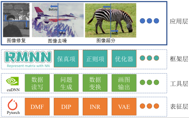

# 中文版
## 什么是RMNN？
RMNN全称为Represent Matrix with Neural Network，即使用神经网络来表征矩阵。
实际上，RMNN不仅仅可以用来表征矩阵，其实对于张量以及非网格数据都是可以进行表征的。RMNN提供了高级API可以快速利用最新的信号表征方式，如 DMF (Deep Matrix Factorization)[1], INR (Implicit Neural Representation)[2], LRTFR (Low-Rank Tensor Function Representation)[3]. 此外还可以调用各种正则项，如 TV (Total Variation) [4,5], AIR (Adaptive and Implicit Regularization) [6], INRR (Implicit Neural Representation Regularizer) [7]. 用于求解多种逆问题，如数据缺失、去噪等。

## 如何使用？
main.ipynb 给出了示例代码。

## 设计理念
**解耦和模块化的思想**
解码函数、来自代码的数据，以及来自输入和输出的代码中的核心算法。解耦的具体表达式是代码模块化，这在电子产品设计领域是非常常见的。它可以追溯到冯·诺伊曼的系统，其中计算机系统的每个部分都执行自己的职责，以及标准化之间的交互界面。这一步设计对计算机的繁荣和发展具有特殊的意义，让研究人员和厂商的注意力就聚焦在某一个小模块上精益求精，如CPU看因特尔，GPU看英伟达。

**多尺度聚合思想**
多尺度思想在数学和计算机很多，在数学是一个典型的金字塔算法，小波，计算机在一个典型的例子是编程语言的抽象层，从控制硬件水平，然后随后的高级语言，一步一步让操作灵活性减少同时，提高我们的使用方便。
当然，许多高级语言都是在不失去灵活性的情况下寻求方便的。我还没有达到那个级别，所以我可以做的是更清楚地分解代码层次结构，显示一个抽象层，稍后我可以使用它来决定更改哪个级别的代码。

## 参考文献
[1] Sanjeev Arora, Nadav Cohen, Wei Hu and Yuping Luo. “Implicit Regularization in Deep Matrix Factorization” Neural Information Processing Systems(2019): n. pag.

[2] Vincent Sitzmann, Julien N. P. Martel, Alexander W. Bergman, David B. Lindell and Gordon Wetzstein. “Implicit Neural Representations with Periodic Activation Functions” Neural Information Processing Systems(2020): n. pag.

[3] Yisi Luo, Xile Zhao, Zhemin Li, Michael K. Ng and Deyu Meng. “Low-Rank Tensor Function Representation for Multi-Dimensional Data Recovery” (2022).

[4] Jian-Feng Cai, Bin Dong, Stanley Osher and Zuowei Shen. “Image restoration: Total variation, wavelet frames, and beyond” Journal of the American Mathematical Society(2012): n. pag.

[5] Zhemin Li, Zhi-Qin John Xu, Tao Luo, Hongxia Wang. A regularised deep matrix factorised model of matrix completion for image restoration[J], IET Image Processing, 2022, 16 (12): 3212-3224.

[6] Zhemin Li, Tao Sun, Hongxia Wang, Bao Wang. Adaptive and Implicit Regularization for Matrix Completion[J]. SIAM Journal on Imaging Sciences, 2022, 15(4): 2000-2022.

[7] Zhemin Li, Hongxia Wang*, Deyu Meng. Regularize implicit neural representation by itself[C]. CVPR 2023.

# English
## What is an RMNN?
In fact, RMNN can not only be used to characterize the matrix, but also can be characterized for both tensors and non-grid data. The RMNN provides an advanced API to quickly leverage the latest signal representations, such as DMF (Deep Matrix Factorization) [1], INR (Implicit Neural Representation) [2], and LRTFR (Low-Rank Tensor Function Representation) [3]. You can also call various rules items, such as TV (Total Variation) [4,5], AIR (Adaptive and Implicit Regularization) [6], and INRR (Implicit Neural Representation Regularizer) [7]. To solve multiple inverse problems, such as data missing, denoising, etc.
## how to use?
main.ipynb The sample code is given.
## Design idea

1. Idea of decoupling and modularization

Decouple functions, data from code, and core algorithms within code from input and output. The advantage of decoupling is that the code can grow by iterating through the parts rather than pulling them together. The specific expression of decoupling is code modularization, which is very common in the field of electronic product design. It can be traced back to von Neumann's system, in which each part of the computer system performs its own duties and the interaction interface between standardization. This step design is of special significance to the subsequent prosperity and development of the computer.

2. Multi-scale aggregation idea

Multi-scale thought in mathematics and computer are many, in mathematics is a typical pyramid algorithm, wavelet, the computer inside a typical example is the abstraction layers of the programming language, from the controlling hardware level, and then to subsequent high-level language, step by step is let's operating flexibility to reduce at the same time, improve our use convenience.

Of course, many high-level languages strive for convenience without losing flexibility. I'm not at that level yet, so what I can do is break down the code hierarchy more clearly, showing a layer of abstraction that I can use later to decide which level of code to change.

